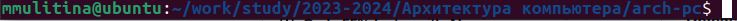
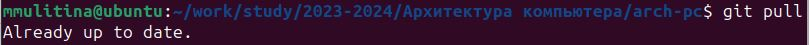
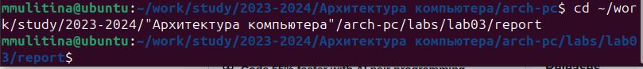
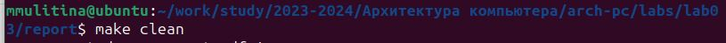
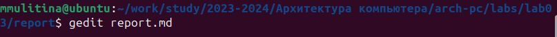
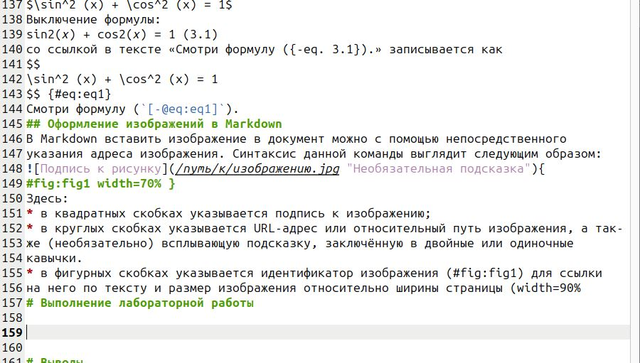

---
## Front matter
title: "Лабораторная работа №3"
subtitle: "НКАбд-06-23"
author: "Улитина Мария Максимовна"

## Generic otions
lang: ru-RU
toc-title: "Содержание"

## Bibliography
bibliography: bib/cite.bib
csl: pandoc/csl/gost-r-7-0-5-2008-numeric.csl

## Pdf output format
toc: true # Table of contents
toc-depth: 2
lof: true # List of figures
lot: true # List of tables
fontsize: 12pt
linestretch: 1.5
papersize: a4
documentclass: scrreprt
## I18n polyglossia
polyglossia-lang:
  name: russian
  options:
	- spelling=modern
	- babelshorthands=true
polyglossia-otherlangs:
  name: english
## I18n babel
babel-lang: russian
babel-otherlangs: english
## Fonts
mainfont: PT Serif
romanfont: PT Serif
sansfont: PT Sans
monofont: PT Mono
mainfontoptions: Ligatures=TeX
romanfontoptions: Ligatures=TeX
sansfontoptions: Ligatures=TeX,Scale=MatchLowercase
monofontoptions: Scale=MatchLowercase,Scale=0.9
## Biblatex
biblatex: true
biblio-style: "gost-numeric"
biblatexoptions:
  - parentracker=true
  - backend=biber
  - hyperref=auto
  - language=auto
  - autolang=other*
  - citestyle=gost-numeric
## Pandoc-crossref LaTeX customization
figureTitle: "Рис."
tableTitle: "Таблица"
listingTitle: "Листинг"
lofTitle: "Список иллюстраций"
lotTitle: "Список таблиц"
lolTitle: "Листинги"
## Misc options
indent: true
header-includes:
  - \usepackage{indentfirst}
  - \usepackage{float} # keep figures where there are in the text
  - \floatplacement{figure}{H} # keep figures where there are in the text
---

# Цель работы

Целью работы является освоение процедуры оформления отчетов с помощью легковесного языка разметки Markdown.

# Задание
1. В соответствующем каталоге сделайте отчёт по лабораторной работе No 2 в формате Markdown. В качестве отчёта необходимо предоставить отчёты в 3 форматах: pdf, docx и md.
2. Загрузите файлы на github.

# Теоретическое введение

## Базовые сведения о Markdown
Чтобы создать заголовок, используйте знак #, например:
# This is heading 1
## This is heading 2
### This is heading 3
#### This is heading 4
Чтобы задать для текста полужирное начертание, заключите его в двойные звездочки:
This text is **bold**.
Чтобы задать для текста курсивное начертание, заключите его в одинарные звездочки:
This text is *italic*.
Чтобы задать для текста полужирное и курсивное начертание, заключите его в тройные
звездочки:
This is text is both ***bold and italic***.
Блоки цитирования создаются с помощью символа >:
> The drought had lasted now for ten million years, and the reign of the
terrible lizards had long since ended. Here on the Equator, in the
continent which would one day be known as Africa, the battle for existence
had reached a new climax of ferocity, and the victor was not yet in sight.
In this barren and desiccated land, only the small or the swift or the
fierce could flourish, or even hope to survive.

Упорядоченный список можно отформатировать с помощью соответствующих цифр:

1. First instruction
	1. Sub-instruction
	1. Sub-instruction
1. Second instruction
Чтобы вложить один список в другой, добавьте отступ для элементов дочернего списка:
1. 	First instruction
1. 	Second instruction
1. 	Third instruction
Неупорядоченный (маркированный) список можно отформатировать с помощью звездо-
чек или тире:
* List item 1
* List item 2
* List item 3
Чтобы вложить один список в другой, добавьте отступ для элементов дочернего списка:
- List item 1
	- List item A
	- List item B
- List item 2
Синтаксис Markdown для встроенной ссылки состоит из части [link text], представляю-
щей текст гиперссылки, и части (file-name.md) – URL-адреса или имени файла, на который дается ссылка:
[link text](file-name.md)
или
[link text](http://example.com/ "Необязательная подсказка")
Markdown поддерживает как встраивание фрагментов кода в предложение, так и их разме-
щение между предложениями в виде отдельных огражденных блоков. Огражденные блоки
кода — это простой способ выделить синтаксис для фрагментов кода. Общий формат огражденных блоков кода:
``` language
your code goes in here
```
## Оформление изображений в Markdown
В Markdown вставить изображение в документ можно с помощью непосредственного
указания адреса изображения.
Здесь:
* в квадратных скобках указывается подпись к изображению;
* в круглых скобках указывается URL-адрес или относительный путь изображения, а так-
же (необязательно) всплывающую подсказку, заключённую в двойные или одиночные
кавычки.
* в фигурных скобках указывается идентификатор изображения (#fig:fig1) для ссылки
на него по тексту и размер изображения относительно ширины страницы (width=90%)
# Выполнение лабораторной работы
В начале выполнения лабораторной работы откроем терминал и перейдём в каталог курса, сформированного при выполнении лабораторной работы №2 (рис. [-@fig:1]).
{#fig:1 width=70%}
Обновим локальный репозиторий, скачав изменения из удаленного репозитория (рис. [-@fig:2]).
{#fig:2 width=70%}
Перейдем в каталог с шаблоном отчета по лабораторной работе №3 (рис. [-@fig:3]).
{#fig:3 width=70%}
Проведём компиляцию шаблона с использованием makefile, введём команду make. 
Удалим полученные файлы с помощью make clean (рис. [-@fig:4]).
{#fig:4 width=70%}.
Откроем файл report.md c помощью gedit (рис. [-@fig:5]).
{#fig:5 width = 70%}
Заполним отчёт и скомпилируем отчёт с помощью Makefile(рис. [@fig:6]).
{#fig:6 width=70%}
Загрузим файлы на github. По вышеописанной схеме создадим также отчёт по лабораторной работе №2 и загрузим его на github.


# Выводы

В процессе выполнения работы я освоила процедуру оформления отчетов с помощью легковесного языка разметки Markdown.

# Список литературы{.unnumbered}
Архитектура ЭВМ. Лабораторная работа №3 и №2.

