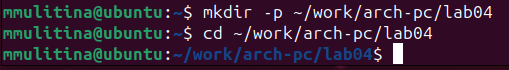
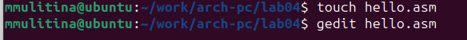
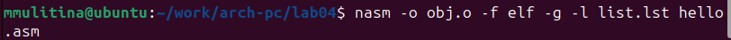
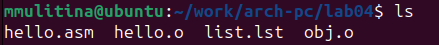
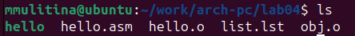
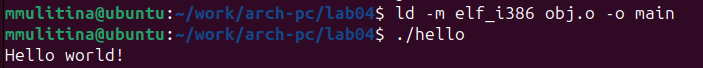
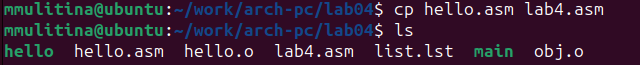
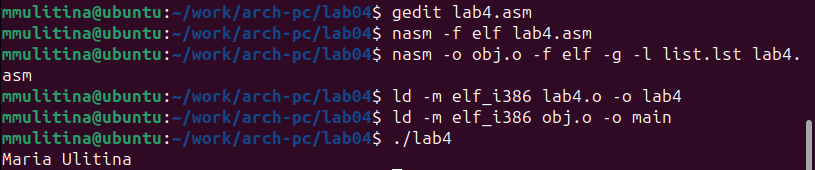

---
## Front matter
title: "Лабораторная работа №4"
subtitle: "НКАбд-06-23"
author: "Улитина Мария Максимовна"

## Generic otions
lang: ru-RU
toc-title: "Содержание"

## Bibliography
bibliography: bib/cite.bib
csl: pandoc/csl/gost-r-7-0-5-2008-numeric.csl

## Pdf output format
toc: true # Table of contents
toc-depth: 2
lof: true # List of figures
lot: true # List of tables
fontsize: 12pt
linestretch: 1.5
papersize: a4
documentclass: scrreprt
## I18n polyglossia
polyglossia-lang:
  name: russian
  options:
	- spelling=modern
	- babelshorthands=true
polyglossia-otherlangs:
  name: english
## I18n babel
babel-lang: russian
babel-otherlangs: english
## Fonts
mainfont: PT Serif
romanfont: PT Serif
sansfont: PT Sans
monofont: PT Mono
mainfontoptions: Ligatures=TeX
romanfontoptions: Ligatures=TeX
sansfontoptions: Ligatures=TeX,Scale=MatchLowercase
monofontoptions: Scale=MatchLowercase,Scale=0.9
## Biblatex
biblatex: true
biblio-style: "gost-numeric"
biblatexoptions:
  - parentracker=true
  - backend=biber
  - hyperref=auto
  - language=auto
  - autolang=other*
  - citestyle=gost-numeric
## Pandoc-crossref LaTeX customization
figureTitle: "Рис."
tableTitle: "Таблица"
listingTitle: "Листинг"
lofTitle: "Список иллюстраций"
lotTitle: "Список таблиц"
lolTitle: "Листинги"
## Misc options
indent: true
header-includes:
  - \usepackage{indentfirst}
  - \usepackage{float} # keep figures where there are in the text
  - \floatplacement{figure}{H} # keep figures where there are in the text
---

# Цель работы

Освоение процедуры компиляции и сборки программ, написанных на ассемблере NASM.

# Задание

1. Написание программы "Hello world!";
2. Работа с транслятором NASM;
3. Работа с расширенным синтаксисом командной строки NASM;
4. Работа с компоновщиком LD;
5. Создание и запуск lab4.asm

# Теоретическое введение

Основными функциональными элементами любой электронно-вычислительной машины (ЭВМ)
являются центральный процессор, память и периферийные устройства.
Взаимодействие этих устройств осуществляется через общую шину, к которой они подключены.
Физически шина представляет собой большое количество проводников, соединяющих устройства друг с другом.
В современных компьютерах проводники выполнены в виде электропроводящих дорожек на материнской (системной) плате.
Основной задачей процессора является обработка информации, а также организация
координации всех узлов компьютера. В состав **центрального процессора (ЦП)** входят
следующие устройства:

• **арифметико-логическое устройство (АЛУ)** — выполняет логические и арифметиче-
ские действия, необходимые для обработки информации, хранящейся в памяти;

• **устройство управления (УУ)** — обеспечивает управление и контроль всех устройств
компьютера;

• **регистры** — сверхбыстрая оперативная память небольшого объёма, входящая в состав
процессора, для временного хранения промежуточных результатов выполнения 
инструкций; регистры процессора делятся на два типа: регистры общего назначения и
специальные регистры.
	Для того, чтобы писать программы на ассемблере, необходимо знать, какие регистры
процессора существуют и как их можно использовать. Большинство команд в программах
написанных на ассемблере используют регистры в качестве операндов. Практически все
команды представляют собой преобразование данных хранящихся в регистрах процессора,
это например пересылка данных между регистрами или между регистрами и памятью, пре-
образование (арифметические или логические операции) данных хранящихся в регистрах.

## Ассемблер и язык ассемблера

Язык ассемблера (assembly language, сокращённо asm) — машинно-ориентированный 
язык низкого уровня. Можно считать, что он больше любых других языков приближен к
архитектуре ЭВМ и её аппаратным возможностям, что позволяет получить к ним более
полный доступ, нежели в языках высокого уровня, таких как C/C++, Perl, Python и пр.
Заметим, что получить полный доступ к ресурсам компьютера в современных архитектурах 
нельзя, самым низким уровнем работы прикладной программы является обращение напрямую к
ядру операционной системы. Именно на этом уровне и работают программы, написанные
на ассемблере. Но в отличие от языков высокого уровня ассемблерная программа содержит
только тот код, который ввёл программист. Таким образом язык ассемблера — это язык, с
помощью которого понятным для человека образом пишутся команды для процессора.

## Процесс создания и обработки программы на языке ассемблера
В процессе создания ассемблерной программы можно выделить четыре шага:

• Набор текста программы в текстовом редакторе и сохранение её в отдельном файле.
Каждый файл имеет свой тип (или расширение), который определяет назначение файла.
Файлы с исходным текстом программ на языке ассемблера имеют тип asm.

• Трансляция — преобразование с помощью транслятора, например nasm, текста про-
граммы в машинный код, называемый объектным. На данном этапе также может быть
получен листинг программы, содержащий кроме текста программы различную допол-
нительную информацию, созданную транслятором. Тип объектного файла — o, файла
листинга — lst.

• Компоновка или линковка — этап обработки объектного кода компоновщиком (ld),
который принимает на вход объектные файлы и собирает по ним исполняемый файл.
Исполняемый файл обычно не имеет расширения. Кроме того, можно получить файл
карты загрузки программы в ОЗУ, имеющий расширение map.

• Запуск программы. Конечной целью является работоспособный исполняемый файл.
Ошибки на предыдущих этапах могут привести к некорректной работе программы,
поэтому может присутствовать этап отладки программы при помощи специальной
программы — отладчика. При нахождении ошибки необходимо провести коррекцию
программы, начиная с первого шага.

# Выполнение лабораторной работы

## Программа Hello world!
Создадим каталог для работы с программами на языке ассемблера NASM и перейдем в созданный каталог(рис.1 [@fig:fig1]).
{#fig:fig1 width=70%}

Создадим текстовый  файл с именем hello.asm, откроем его с помощью gedit, введём в него предоставленный в лабораторной работе текст(рис.2 [@fig:fig2]).
{#fig:fig2 width=70%}

## Транслятор NASM
Для компиляции текста из файла программы создадим объектный файл(рис.3 [@fig:fig3]).
{#fig:fig3  width=70%}

и проверим его наличие с помощью ls (рис.4 [@fig:fig4]).
{#fig:fig4 width=70%}

## Расширенный синтаксис командной строки NASM
Скомпилируем исходный файл hello.asm  в obj.o (рис.5. [@fig:fig5])
{#fig:fig5 width=70%}
С помощью ls проверим, что файлы были созданы (рис.6 [@fig:fig6]).
{#fig:fig6 width=70%}

## Компоновщик LD
Передадим объектный файл на обработку компоновщику (рис.7 [@fig:fig7]).
{#fig:fig7 width=70%}

С помощью ls проверим, что исполняемый файл hello был создан (рис.8 [@fig:fig8]).
{#fig:fig8 width=70%}
Зададим с помощью ключа -о имя создаваемого исполняемого файла (рис.9 [@fig:fig9]).
{#fig:fig9 width=70%}

## Запуск исполняемого файла
Запустим на выполнение созданный исполняемый файл (рис.9 [@fig:fig10]).
{#fig:fig10 width=70%}

## Выполнение заданий для самостоятельной работы
Создадим с помощью команды cp создадим копию файла hello.asm с именем lab4.asm (рис. 10 [@fig:fig11]).
{#fig:fig11 width=70%}

Проверим с помощью ls успешность создания копии.
С помощью текстового редактора внесём изменения к текст программы, чтобы на экран выводилась строка с фамилией и именем.
Оттранслируем полученный текст программы lab4.asm в объектный файл. 
Выполним компоновку объектного файла и запустим получившийся исполняемый файл(рис.12 [@fig:fig12]).
{#fig:fig12 width=70%}

# Выводы

В процессе выполнения лабораторной работы я освоила процедуры компиляции и сборки программ, написанных на ассемблере NASM.

# Список литературы.

Архитектура ЭВМ. Лабораторная работа №4.
