---
## Front matter
title: "Лабораторная работа №5"
subtitle: "НКАбр-06-23"
author: "Улитина Мария Максимовна"

## Generic otions
lang: ru-RU
toc-title: "Содержание"

## Bibliography
bibliography: bib/cite.bib
csl: pandoc/csl/gost-r-7-0-5-2008-numeric.csl

## Pdf output format
toc: true # Table of contents
toc-depth: 2
lof: true # List of figures
lot: true # List of tables
fontsize: 12pt
linestretch: 1.5
papersize: a4
documentclass: scrreprt
## I18n polyglossia
polyglossia-lang:
  name: russian
  options:
	- spelling=modern
	- babelshorthands=true
polyglossia-otherlangs:
  name: english
## I18n babel
babel-lang: russian
babel-otherlangs: english
## Fonts
mainfont: PT Serif
romanfont: PT Serif
sansfont: PT Sans
monofont: PT Mono
mainfontoptions: Ligatures=TeX
romanfontoptions: Ligatures=TeX
sansfontoptions: Ligatures=TeX,Scale=MatchLowercase
monofontoptions: Scale=MatchLowercase,Scale=0.9
## Biblatex
biblatex: true
biblio-style: "gost-numeric"
biblatexoptions:
  - parentracker=true
  - backend=biber
  - hyperref=auto
  - language=auto
  - autolang=other*
  - citestyle=gost-numeric
## Pandoc-crossref LaTeX customization
figureTitle: "Рис."
tableTitle: "Таблица"
listingTitle: "Листинг"
lofTitle: "Список иллюстраций"
lotTitle: "Список таблиц"
lolTitle: "Листинги"
## Misc options
indent: true
header-includes:
  - \usepackage{indentfirst}
  - \usepackage{float} # keep figures where there are in the text
  - \floatplacement{figure}{H} # keep figures where there are in the text
---

# Цель работы

Приобретение практических навыков работы в Midnight Commander. Освоение инструкций языка ассемблера mov и int.

# Задание

1. Создание и исполнение файла lab5-1.
2. Подключение внешнего файла in_out.asm
3. Создание копии файла  lab5-1;внесение изменения в программу для вывода введённой строки на экран.
4. Создание копии файла  lab5-2;внесение изменения в программу для вывода введённой строки на экран.

# Теоретическое введение

Midnight Commander (или просто mc) — это программа, которая позволяет просматривать структуру каталогов и выполнять основные операции по управлению файловой системой, т.е. mc является файловым менеджером. Midnight Commander позволяет сделать работу с
файлами более удобной и наглядной.
Для активации оболочки Midnight Commander достаточно ввести в командной строке mc и нажать клавишу Enter.
В Midnight Commander используются функциональные клавиши F1 — F10 , к которым привязаны часто выполняемые операции.

Следующие комбинации клавиш облегчают работу с Midnight Commander:

• Tab используется для переключениями между панелями;

• ↑ и ↓ используется для навигации, Enter для входа в каталог или открытия файла (если в файле расширений mc.ext заданы правила связи определённых расширений файлов с инструментами их запуска или обработки);

• Ctrl + u (или через меню Команда > Переставить панели ) меняет местами содержимое правой и левой панелей;

• Ctrl + o (или через меню Команда > Отключить панели ) скрывает или возвращает панели Midnight Commander, за которыми доступен для работы командный интерпретатор оболочки и выводимая туда информация.

• Ctrl + x + d (или через меню Команда > Сравнить каталоги) позволяет сравнить содержимое каталогов, отображаемых на левой и правой панелях.

## Структура программы на языке ассемблера NASM

Программа на языке ассемблера NASM, как правило, состоит из трёх секций: секция кода программы (SECTION .text), секция инициированных (известных во время компиляции) данных (SECTION .data) и секция неинициализированных данных (тех, под которые во время компиляции только отводится память, а значение присваивается в ходе выполнения
программы) (SECTION .bss)

Для объявления инициированных данных в секции .data используются директивы DB, DW,
DD, DQ и DT, которые резервируют память и указывают, какие значения должны храниться в
этой памяти:

• DB (define byte) — определяет переменную размером в 1 байт;

• DW (define word) — определяет переменную размеров в 2 байта (слово);

• DD (define double word) — определяет переменную размером в 4 байта (двойное слово);

• DQ (define quad word) — определяет переменную размером в 8 байт (учетверённое слово);

• DT (define ten bytes) — определяет переменную размером в 10 байт.

Директивы используются для объявления простых переменных и для объявления массивов. Для определения строк принято использовать директиву DB в связи с особенностями хранения данных в оперативной памяти. Синтаксис директив определения данных следующий:
<имя> DB <операнд> [, <операнд>] [, <операнд>].

## Элементы программирования

### Описание инструкции mov

Инструкция языка ассемблера mov предназначена для дублирования данных источника в приёмнике. В общем виде эта инструкция записывается в виде mov dst,src
Здесь операнд dst — приёмник, а src — источник. В качестве операнда могут выступать регистры (register), ячейки памяти (memory) и непо-
средственные значения (const). 

### Описание инструкции int

Инструкция языка ассемблера int предназначена для вызова прерывания с указанным номером. В общем виде она записывается в виде int n
Здесь n — номер прерывания, принадлежащий диапазону 0–255.
При программировании в Linux с использованием вызовов ядра sys_calls n=80h (принято задавать в шестнадцатеричной системе счисления).

# Выполнение лабораторной работы

Откроем Midnight Commander, перейдём в необходимый каталог  (рис.[-@fig:fig1]

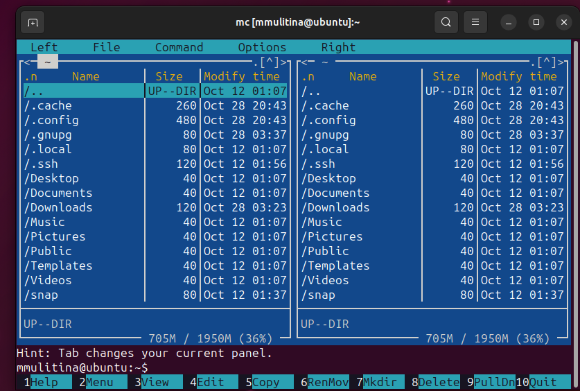{#fig:1 width=70%}

С помощью функциональной клавиши F7 создадим папку lab05 и перейдем в созданный каталог (рис.[-@fig:fig2]

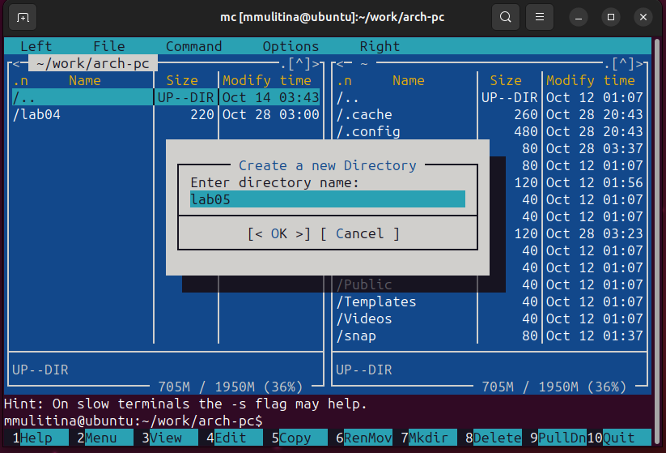{#fig:2 width=70%}

С помощью touch создадим файл lab5-1.asm (рис.[-@fig:fig3]

{#fig:3 width=70%}

С помощью F4 откроем файл lab5-1.asm для редактирования в редакторе nano (рис.[-@fig:fig4]

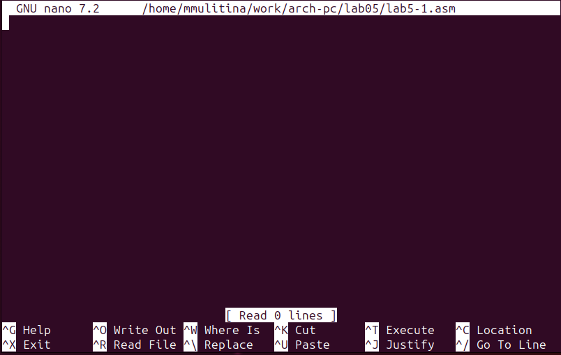{#fig:4 width=70%}

Введем текст программы (рис.[-@fig:fig5]

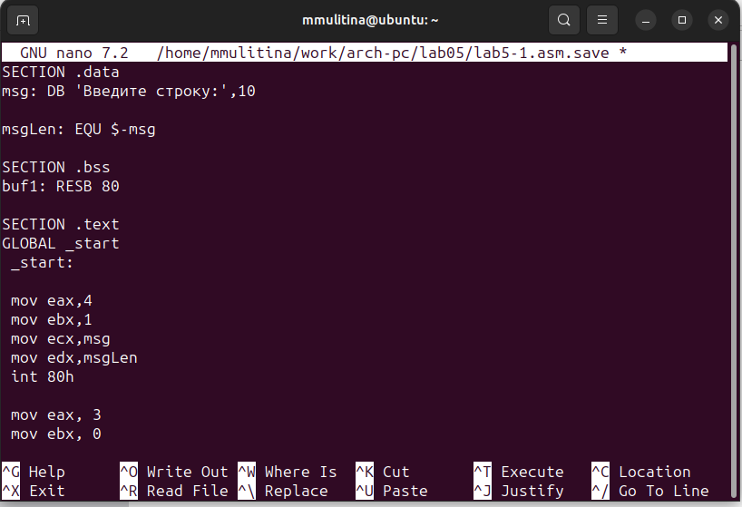{#fig:5 width=70%}

С помощью F3 откроем файл lab5-1.asm для просмотра и убедимся, что она содержит текст программы.

Оттранслируем программу в объектный файл. ВЫполним компоновку объектного файла (рис.[-@fig:fig6]

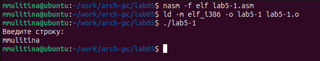{#fig:6 width=70%}

Скачаем файл in_out.asm и поместим его в соответствующий каталог.
Создадим копию lab5-1.asm  с помощью F6 (рис.[-@fig:fig7]

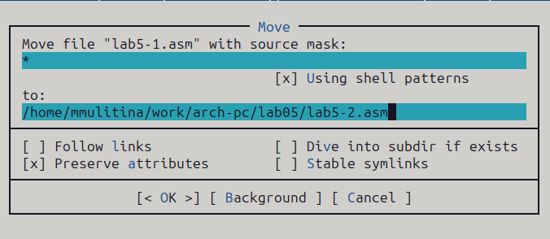{#fig:7 width=70%}

Исправим текст программы с использование подпрограмм из внешнего файла (рис.[-@fig:fig8]

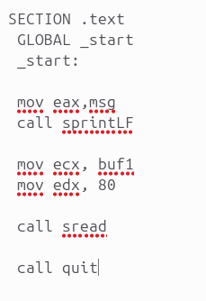{#fig:8 width=70%}

Создадим исполняемый файл и проверим его работу (рис.[-@fig:fig9]

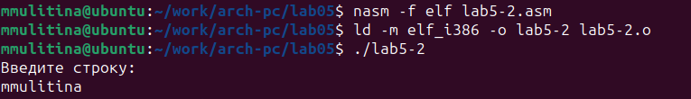{#fig:9 width=70%}

Заменим sprintLF на sprint - теперь вывод и ввод на одной строке (рис.[-@fig:fig10]

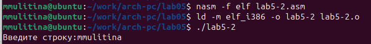{#fig:10 width=70%} 

## Задания для самостоятельной работы

Создадим копию файла lab5-1.asm (рис.[-@fig:fig11]

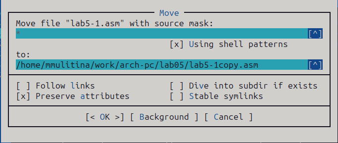{#fig:11 width=70%} 

Внесём изменения в программу, чтобы она выводила введённую пользователем строку на экран (рис.[-@fig:fig12]

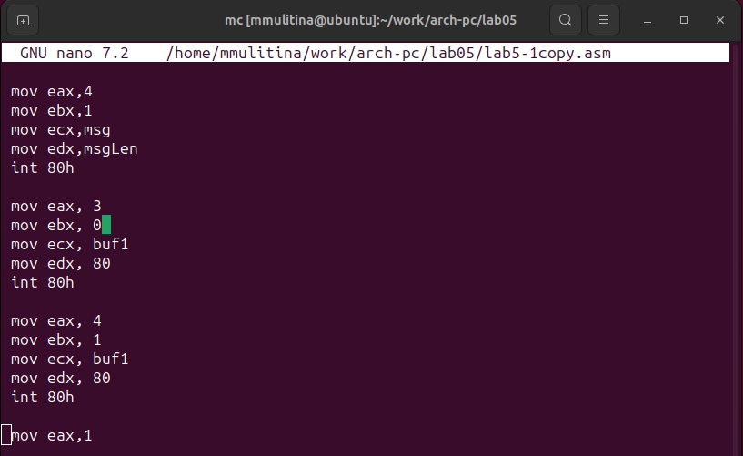{#fig:12 width=70%} 

Запустим программу (рис.[-@fig:fig13]

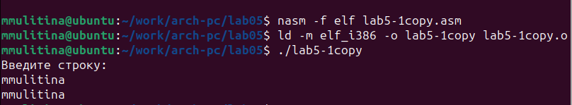{#fig:13 width=70%}.

Создадим копию файла lab5-2.asm (рис.[-@fig:fig14]

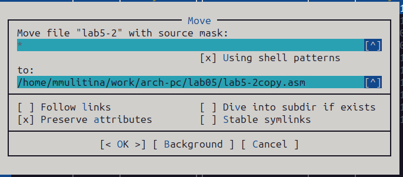{#fig:14 width=70%} 

Внесём изменения в программу, чтобы она выводила введённую пользователем строку на экран (рис.[-@fig:fig15]

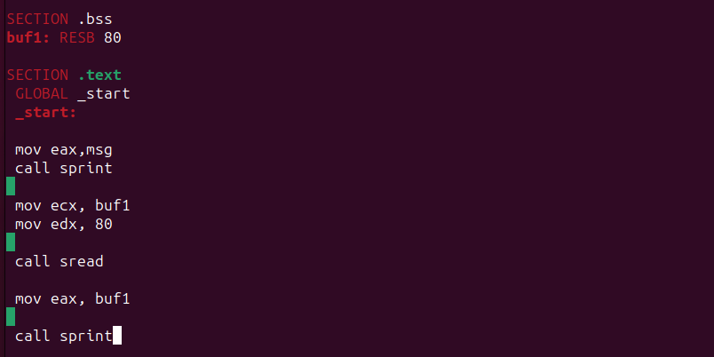{#fig:15 width=70%} 

Запустим программу (рис.[-@fig:fig16]

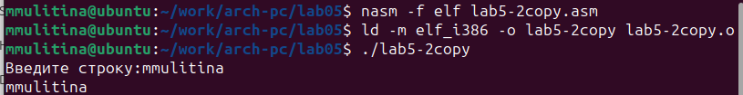{#fig:16 width=70%}.

# Выводы

В процессе выполнения работы я приобрела практические навыки работы в Midnight Commander и освоила инструкции на языке ассемблера mov и int.  

# Список литературы{.unnumbered}

Архитектура ЭВМ. Лабораторная работа №5.
