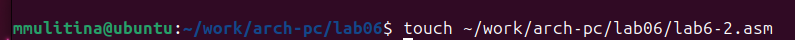

---
## Front matter
title: "Лабораторная работа №6"
subtitle: "НКАбд-06-23"
author: "Улитина Мария Максимовна"

## Generic otions
lang: ru-RU
toc-title: "Содержание"

## Bibliography
bibliography: bib/cite.bib
csl: pandoc/csl/gost-r-7-0-5-2008-numeric.csl

## Pdf output format
toc: true # Table of contents
toc-depth: 2
lof: true # List of figures
lot: true # List of tables
fontsize: 12pt
linestretch: 1.5
papersize: a4
documentclass: scrreprt
## I18n polyglossia
polyglossia-lang:
  name: russian
  options:
	- spelling=modern
	- babelshorthands=true
polyglossia-otherlangs:
  name: english
## I18n babel
babel-lang: russian
babel-otherlangs: english
## Fonts
mainfont: PT Serif
romanfont: PT Serif
sansfont: PT Sans
monofont: PT Mono
mainfontoptions: Ligatures=TeX
romanfontoptions: Ligatures=TeX
sansfontoptions: Ligatures=TeX,Scale=MatchLowercase
monofontoptions: Scale=MatchLowercase,Scale=0.9
## Biblatex
biblatex: true
biblio-style: "gost-numeric"
biblatexoptions:
  - parentracker=true
  - backend=biber
  - hyperref=auto
  - language=auto
  - autolang=other*
  - citestyle=gost-numeric
## Pandoc-crossref LaTeX customization
figureTitle: "Рис."
tableTitle: "Таблица"
listingTitle: "Листинг"
lofTitle: "Список иллюстраций"
lotTitle: "Список таблиц"
lolTitle: "Листинги"
## Misc options
indent: true
header-includes:
  - \usepackage{indentfirst}
  - \usepackage{float} # keep figures where there are in the text
  - \floatplacement{figure}{H} # keep figures where there are in the text
---

# Цель работы

Освоение арифметических инструкций языка ассемблера NASM.

# Задание

1. Работа с символьными и численными данными в NASM.
2. Выполнение арифметических операций в NASM.
3. Написание программы для вычисления заданного выражения.

# Теоретическое введение

## Адресация в NASM

Большинство инструкций на языке ассемблера требуют обработки операндов. Адрес операнда предоставляет место, где хранятся данные, подлежащие обработке. Это могут быть данные хранящиеся в регистре или в ячейке памяти. Далее рассмотрены все существующие способы задания адреса хранения операндов – способы адресации.
Существует три основных способа адресации:
• Регистровая адресация – операнды хранятся в регистрах и в команде используются имена этих регистров, например: mov ax,bx.

• Непосредственная адресация – значение операнда задается непосредственно в команде, Например: mov ax,2.

• Адресация памяти – операнд задает адрес в памяти. В команде указывается символическое обозначение ячейки памяти, над содержимым которой требуется выполнить операцию.

## Арифметические операции в NASM

### Целочисленное сложение add.

Схема команды целочисленного сложения add (от англ. addition - добавление) выполняет сложение двух операндов и записывает результат по адресу первого операнда. Команда addработает как с числами со знаком, так и без знака и выглядит следующим образом: add <операнд_1>, <операнд_2>

### Целочисленное вычитание sub.

Команда целочисленного вычитания sub (от англ. subtraction – вычитание) работает аналогично команде add и выглядит следующим образом: sub <операнд_1>, <операнд_2>

### Команды инкремента и декремента.

Довольно часто при написании программ встречается операция прибавления или вычитания единицы. Прибавление единицы называется инкрементом, а вычитание — декрементом.
Для этих операций существуют специальные команды: inc (от англ. increment) и dec (от англ. decrement), которые увеличивают и уменьшают на 1 свой операнд.
Эти команды содержат один операнд и имеет следующий вид:
inc <операнд>
dec <операнд>

### Команда изменения знака операнда neg.

Еще одна команда, которую можно отнести к арифметическим командам это команда изменения знака neg:
neg <операнд>
Команда neg рассматривает свой операнд как число со знаком и меняет знак операнда на противоположный. 

### Команды умножения mul и imul.

Умножение и деление, в отличии от сложения и вычитания, для знаковых и беззнаковых чисел производиться по-разному, поэтому существуют различные команды.
Для беззнакового умножения используется команда mul (от англ. multiply – умножение): mul <операнд>
Для знакового умножения используется команда imul: imul <операнд>
Для команд умножения один из сомножителей указывается в команде и должен находиться в регистре или в памяти, но не может быть непосредственным операндом. Второйсомножитель в команде явно не указывается и должен находиться в регистре EAX,AX или AL, а результат помещается в регистры EDX:EAX, DX:AX или AX, в зависимости от размера операнда.

### Команды деления div и idiv.

Для деления, как и для умножения, существует 2 команды div (от англ. divide - деление) и idiv:
div <делитель> - Беззнаковое деление
idiv <делитель> - наковое деление
В командах указывается только один операнд – делитель, который может быть регистром или ячейкой памяти, но не может быть непосредственным операндом. Местоположение делимого и результата для команд деления зависит от размера делителя. Кроме того, так как в результате деления получается два числа – частное и остаток, то эти числа помещаются в определённые регистры.

## Перевод символа числа в десятичную символьную запись.

Ввод информации с клавиатуры и вывод её на экран осуществляется в символьном виде. Кодирование этой информации производится согласно кодовой таблице символов ASCII.
ASCII – сокращение от American Standard Code for Information Interchange (Американский стандартный код для обмена информацией). Согласно стандарту ASCII каждый символ кодируется одним байтом.
Расширенная таблица ASCII состоит из двух частей. Первая (символы с кодами 0-127) является универсальной, а вторая (коды 128-255) предназначена для специальных символов и букв национальных алфавитов и на компьютерах разных типов может меняться.
Среди инструкций NASM нет такой, которая выводит числа (не в символьном виде). Поэтому, например, чтобы вывести число, надо предварительно преобразовать его цифры в ASCII-коды этих цифр и выводить на экран эти коды, а не само число. Если же выводить число на экран непосредственно, то экран воспримет его не как число, а как последовательность ASCII-символов – каждый байт числа будет воспринят как один ASCII-символ – и выведет на экран эти символы.
Аналогичная ситуация происходит и при вводе данных с клавиатуры. Введенные данные будут представлять собой символы, что сделает невозможным получение корректного результата при выполнении над ними арифметических операций.
Для решения этой проблемы необходимо проводить преобразование ASCII символов в
числа и обратно.

# Выполнение лабораторной работы

Создадим каталог для программ, перейдём в него и создадим файл lab6-1.asm (рис. @fig:001).

{#fig:001 width=70%}

Введём необходимый листинг в файл (рис. @fig:002).

{#fig:002 width=70%}

Создадим исполняемый файл и запустим его (рис. @fig:003).

{#fig:003 width=70%}

Изменим текст программы, заменим mov eax, '6'; mov ebx, '4' на mov eax, 6; mov ebx, 4. Код 10 соответствует переносу строки, не отображается (рис. @fig:004).

{#fig:004 width=70%}

Создадим файл lab6-2.asm (рис. @fig:005).

{#fig:005 width=70%}

Введём в файл предложенный листинг (рис. @fig:006).

{#fig:006 width=70%}

Создадим исполняемый файл и запустим его (рис. @fig:007).

{#fig:007 width=70%}

Получаем число 106, сложив коды символов '6' и '4'.
Аналогично предыдущему файлу заменим строки (рис. @fig:008).

{#fig:008 width=70%}

Создадим исполняемый файл и запустим его (рис. @fig:009).

{#fig:009 width=70%}

Получим значение 10.

Заменим iprintLF на iprint, создадим исполняемый файл и запустим (рис. @fig:010).

{#fig:010 width=70%}

(рис. @fig:011).

{#fig:011 width=70%}

С iprint не будет переноса строки.

## Выполнение арифметических операций в NASM.

Создадим файл lab6-3.asm (рис. @fig:012).

{#fig:012 width=70%}

Введём в созданный файл необходимый листинг (рис. @fig:013).

{#fig:013 width=70%}

Создадим исполняемый файл и запустим его (рис. @fig:014).

{#fig:014 width=70%}

Изменим текст программы для вычисления выражения *f(x) = (4*6+2)/5* (рис. @fig:015).

{#fig:015 width=70%}

Запустим исполняемый файл и проверим его работу (рис. @fig:016).

{#fig:016 width=70%}

Создадим файл variant.asm, введём в него предложенный листинг (рис. @fig:017).

{#fig:017 width=70%}

Создадим исполняемый файл и проверим его работу (рис. @fig:018).

{#fig:018 width=70%}

Ответы на вопросы:

1. За вывод на экран сообщения "Ваш вариант" отвечают строки 
*mov eax, msg   
call sprintLF*

2. Инструкции используются для считывания вводимого пользователем значения и записи его в переменную x.

3. Функция atoi преобразует ascii - код символа в целое число и записывает результат в регистр eax,  перед вызовом atoi  в регистр eax необходимо записать число.

4. За вычисление варианта отвечают строки 
*xor edx, edx
mov ebx, 20
div ebx
inc edx*

5. В edx.
6. Для увелечения остатка на 1. 
7. *mov eax, edx
call iprintLF*

## Задания для самостоятельной работы.

Напишем программу для варианта 3 (рис. @fig:019).

{#fig:019 width=70%}

Запустим её и проверим на преждложенных значениях (рис. @fig:020).

{#fig:020 width=70%}

# Выводы

В процессе выполнения работы я освоила арифметические инструкции языка ассемблера NASM.

# Список литературы{.unnumbered}

Архитектура ЭВМ. Лабораторная работа №6.
