---
## Front matter
title: "Лабораторная работа №7"
subtitle: "НКАбд-06-23"
author: "Улитина Мария Максимовна"

## Generic otions
lang: ru-RU
toc-title: "Содержание"

## Bibliography
bibliography: bib/cite.bib
csl: pandoc/csl/gost-r-7-0-5-2008-numeric.csl

## Pdf output format
toc: true # Table of contents
toc-depth: 2
lof: true # List of figures
lot: true # List of tables
fontsize: 12pt
linestretch: 1.5
papersize: a4
documentclass: scrreprt
## I18n polyglossia
polyglossia-lang:
  name: russian
  options:
	- spelling=modern
	- babelshorthands=true
polyglossia-otherlangs:
  name: english
## I18n babel
babel-lang: russian
babel-otherlangs: english
## Fonts
mainfont: PT Serif
romanfont: PT Serif
sansfont: PT Sans
monofont: PT Mono
mainfontoptions: Ligatures=TeX
romanfontoptions: Ligatures=TeX
sansfontoptions: Ligatures=TeX,Scale=MatchLowercase
monofontoptions: Scale=MatchLowercase,Scale=0.9
## Biblatex
biblatex: true
biblio-style: "gost-numeric"
biblatexoptions:
  - parentracker=true
  - backend=biber
  - hyperref=auto
  - language=auto
  - autolang=other*
  - citestyle=gost-numeric
## Pandoc-crossref LaTeX customization
figureTitle: "Рис."
tableTitle: "Таблица"
listingTitle: "Листинг"
lofTitle: "Список иллюстраций"
lotTitle: "Список таблиц"
lolTitle: "Листинги"
## Misc options
indent: true
header-includes:
  - \usepackage{indentfirst}
  - \usepackage{float} # keep figures where there are in the text
  - \floatplacement{figure}{H} # keep figures where there are in the text
---

# Цель работы

Изучение команд условного и безусловного переходов. Приобретение навыков написания программ с использованием переходов. Знакомство с назначением и структурой файла листинга.

# Задание

1. Реализация переходов в NASM.

2. Изучение структуры файла листинга.

3. Написание программы нахождения наименьшей из 3 целочисленных переменных.

4. Написание программы для вычисления заданной функции.

# Теоретическое введение

Для реализации ветвлений в ассемблере используются так называемые команды передачи управления или команды перехода. Можно выделить 2 типа переходов:

• условный переход – выполнение или не выполнение перехода в определенную точку программы в зависимости от проверки условия.

• безусловный переход – выполнение передачи управления в определенную точку программы без каких-либо условий.

## Команды безусловного перехода

Безусловный переход выполняется инструкцией jmp (от англ. jump – прыжок), которая включает в себя адрес перехода, куда следует передать управление:
jmp < адрес_перехода >
Адрес перехода может быть либо меткой, либо адресом области памяти, в которую предварительно помещен указатель перехода. Кроме того, в качестве операнда можно использовать имя регистра, в таком случае переход будет осуществляться по адресу, хранящемуся в этом регистре.

## Команды условного перехода

Как отмечалось выше, для условного перехода необходима проверка какого-либо условия. В ассемблере команды условного перехода вычисляют условие перехода анализируя флаги из регистра флагов.

### Регистр флагов

Флаг – это бит, принимающий значение 1 («флаг установлен»), если выполнено некоторое условие, и значение 0 («флаг сброшен») в противном случае. Флаги работают независимо друг от друга, и лишь для удобства они помещены в единый регистр — регистр флагов, отражающий текущее состояние процессора. В следующей таблице указано положение битовых флагов в регистре флагов.

### Описание инструкции cmp

Инструкция cmp является одной из инструкций, которая позволяет сравнить операнды и выставляет флаги в зависимости от результата сравнения. Инструкция cmp является командой сравнения двух операндов и имеет такой же формат, как и команда вычитания: cmp < операнд_1 >, < операнд_2 >
Команда cmp, так же как и команда вычитания, выполняет вычитание <операнд_2> - <операнд_1>, но результат вычитания никуда не записывается и единственным результатом команды сравнения является формирование флагов.

### Описание команд условного перехода

Команда условного перехода имеет вид j < мнемоника перехода >  label
Мнемоника перехода связана со значением анализируемых флагов или со способом фор-
мирования этих флагов.
В табл. 7.3. представлены команды условного перехода, которые обычно ставятся после
команды сравнения cmp. В их мнемокодах указывается тот результат сравнения, при котором надо делать переход. Мнемоники, идентичные по своему действию, написаны в таблице через дробь (например, ja и jnbe). Программист выбирает, какую из них применить, чтобы получить более простой для понимания текст программы.

## Файл листинга и его структура

Листинг (в рамках понятийного аппарата NASM) — это один из выходных файлов, создаваемых транслятором. Он имеет текстовый вид и нужен при отладке программы, так как кроме строк самой программы он содержит дополнительную информацию.

# Выполнение лабораторной работы

Создадим каталог для программ лабораторной работы №7, перейдём в него и создадим файл lab7-1.asm (рис. @fig:001).

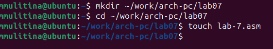{#fig:001 width=70%}

Введём в файл текст программы (рис. @fig:002).

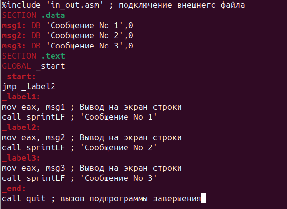{#fig:002 width=70%}

Создадим исполняемый файл и запустим его (рис. @fig:003).

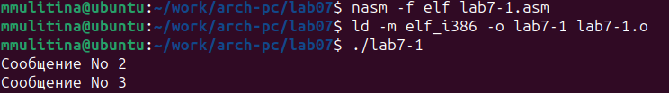{#fig:003 width=70%}

Изменим текст программы (рис. @fig:004).

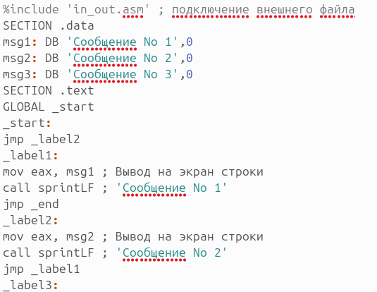{#fig:004 width=70%}

Запустим программу и проверим его работу (рис. @fig:005).

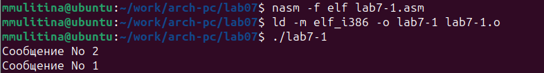{#fig:005 width=70%}

Изменим текст программы (рис. @fig:006).

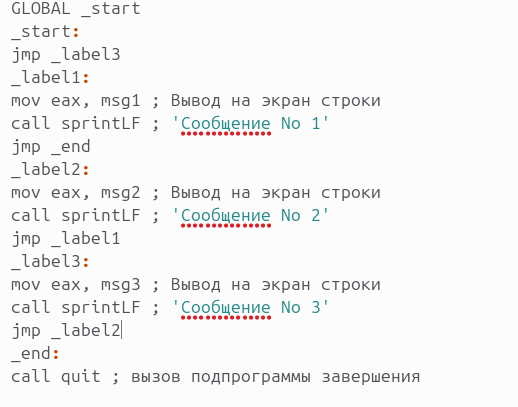{#fig:006 width=70%}

Запустим программу (рис. @fig:007).

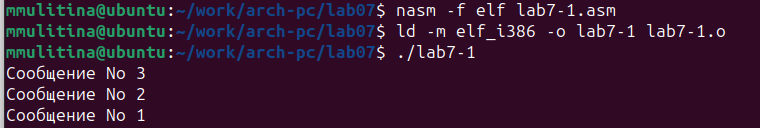{#fig:007 width=70%}

Создадим файл lab7-2.asm (рис. @fig:008).

{#fig:008 width=70%}

и введём в неё предложенный текст (рис. @fig:009).

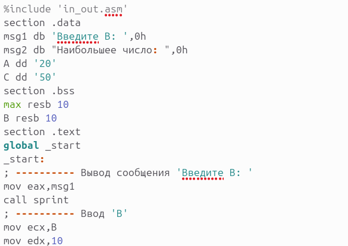{#fig:009 width=70%}

Проверим работу программы с разными значениями (рис. @fig:010).

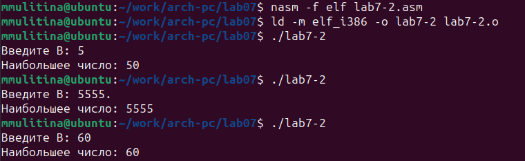{#fig:010 width=70%}

Получим объектный файл, указав ключ -l (рис. @fig:011).

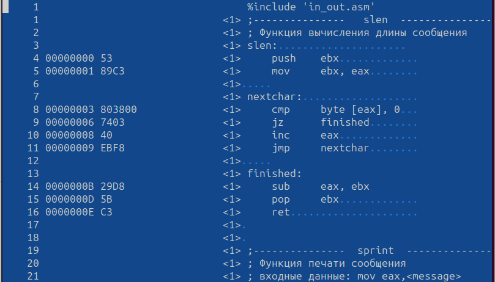{#fig:011 width=70%}

Откроем файл с программой lab7-2.asm и в любой инструкции с двумя операндами удалим один операнд. (рис. @fig:012).

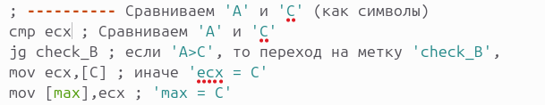{#fig:012 width=70%}

Откроем файл листинга (рис. @fig:013).

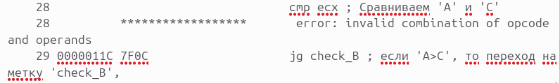{#fig:013 width=70%}

(рис. @fig:014).

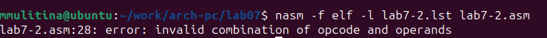{#fig:014 width=70%}

## Задания для самостоятельной работы

Напишем программу для нахождения наименьшей из 3 целочисленных переменных (рис. @fig:015).

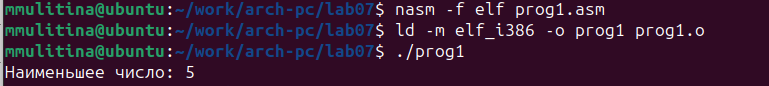{#fig:015 width=70%}

Напишем программу для вычисления функции для введённых с клавиатуры значений (рис. @fig:016).

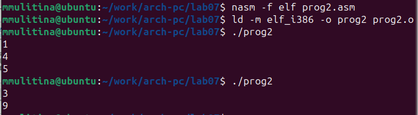{#fig:016 width=70%}

# Выводы

В процессе выполнения работы были изучены команды условного и безусловного переходов. Приобретены навыки написания программ с использованием переходов.

# Список литературы

Архитектура ЭВМ. Лабораторная работа №7.
