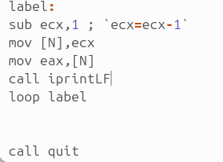
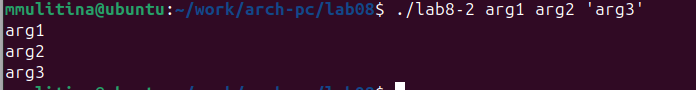

---
## Front matter
title: "Лабораторная работа №8"
subtitle: "НКАбд-06-23"
author: "Улитина Мария Максимовна"

## Generic otions
lang: ru-RU
toc-title: "Содержание"

## Bibliography
bibliography: bib/cite.bib
csl: pandoc/csl/gost-r-7-0-5-2008-numeric.csl

## Pdf output format
toc: true # Table of contents
toc-depth: 2
lof: true # List of figures
lot: true # List of tables
fontsize: 12pt
linestretch: 1.5
papersize: a4
documentclass: scrreprt
## I18n polyglossia
polyglossia-lang:
  name: russian
  options:
	- spelling=modern
	- babelshorthands=true
polyglossia-otherlangs:
  name: english
## I18n babel
babel-lang: russian
babel-otherlangs: english
## Fonts
mainfont: PT Serif
romanfont: PT Serif
sansfont: PT Sans
monofont: PT Mono
mainfontoptions: Ligatures=TeX
romanfontoptions: Ligatures=TeX
sansfontoptions: Ligatures=TeX,Scale=MatchLowercase
monofontoptions: Scale=MatchLowercase,Scale=0.9
## Biblatex
biblatex: true
biblio-style: "gost-numeric"
biblatexoptions:
  - parentracker=true
  - backend=biber
  - hyperref=auto
  - language=auto
  - autolang=other*
  - citestyle=gost-numeric
## Pandoc-crossref LaTeX customization
figureTitle: "Рис."
tableTitle: "Таблица"
listingTitle: "Листинг"
lofTitle: "Список иллюстраций"
lotTitle: "Список таблиц"
lolTitle: "Листинги"
## Misc options
indent: true
header-includes:
  - \usepackage{indentfirst}
  - \usepackage{float} # keep figures where there are in the text
  - \floatplacement{figure}{H} # keep figures where there are in the text
---

# Цель работы

Приобретение навыков написания программ с использованием циклов и обработкой аргументов командной строки.

# Задание

1. Реализация циклов в NASM

2. Обработка аргументов командной строки

3. Написание программы для вычисления суммы функций

# Теоретическое введение

## Организация стека

Стек — это структура данных, организованная по принципу LIFO («Last In — First Out» или «последним пришёл — первым ушёл»). Стек является частью архитектуры процессора и реализован на аппаратном уровне. Для работы со стеком в процессоре есть специальные регистры (ss, bp, sp) и команды.
Основной функцией стека является функция сохранения адресов возврата и передачи аргументов при вызове процедур. Кроме того, в нём выделяется память для локальных переменных и могут временно храниться значения регистров.
Стек имеет вершину, адрес последнего добавленного элемента, который хранится в регистре esp (указатель стека). Противоположный конец стека называется дном. Значение, помещённое в стек последним, извлекается первым. При помещении значения в стек указатель стека уменьшается, а при извлечении — увеличивается.
Для стека существует две основные операции:

• добавление элемента в вершину стека (push);

• извлечение элемента из вершины стека (pop).

### Добавление элемента в стек

Команда push размещает значение в стеке, т.е. помещает значение в ячейку памяти, на которую указывает регистр esp, после этого значение регистра esp увеличивается на 4. Данная команда имеет один операнд — значение, которое необходимо поместить в стек.

###  Извлечение элемента из стека

Команда pop извлекает значение из стека, т.е. извлекает значение из ячейки памяти, на которую указывает регистр esp, после этого уменьшает значение регистра esp на 4. У этой команды также один операнд, который может быть регистром или переменной в памяти. Нужно помнить, что извлечённый из стека элемент не стирается из памяти и остаётся как “мусор”, который будет перезаписан при записи нового значения в стек.

## Инструкции организации 

Для организации циклов существуют специальные инструкции. Для всех инструкций максимальное количество проходов задаётся в регистре ecx. Наиболее простой является инструкция loop. Она позволяет организовать безусловный цикл.
Инструкция loop выполняется в два этапа. Сначала из регистра ecx вычитается единица и его значение сравнивается с нулём. Если регистр не равен нулю, то выполняется переход к указанной метке. Иначе переход не выполняется и управление передаётся команде, которая следует сразу после команды loop.

# Выполнение лабораторной работы

Создадим каталог для программ лабораторной работы, перейдём в него и создадим файл lab8-1.asm (рис. @fig:001).

{#fig:001 width=70%}

Введём в файл lab8-1.asm текст программы (рис. @fig:002).

{#fig:002 width=70%}

Проверим работу программы (рис. @fig:003).

{#fig:003 width=70%}

Изменим текст программы (рис. @fig:004).

{#fig:004 width=70%}

Проверим работу программы (рис. @fig:005).

{#fig:005 width=70%}

Снова изменим текст программы (рис. @fig:006).

{#fig:006 width=70%}

Проверим работу программы (рис. @fig:007).

{#fig:007 width=70%}

Создадим файл lab8-2.asm (рис. @fig:008).

{#fig:008 width=70%}

Запустим программу, указав аргументы (рис. @fig:009).

{#fig:009 width=70%}

Создадим файл lab8-3.asm, введём в него необходимый текст программы и запустим его (рис. @fig:010).

{#fig:010 width=70%}

## Задания для самостоятельной работы

Напишем программу для варианта №3 и проверим на разных наборах значений (рис. @fig:011).

{#fig:011 width=70%}

(рис. @fig:012).

{#fig:012 width=70%}

# Выводы

В процессе выполнения работы были приобретены навыки написания программ с использованием циклов и обработкой аргументов командной строкию

# Список литературы

Архитектура ЭВМ. Лабораторная работа №8.
