---
## Front matter
title: "Лабораторная работа  №9"
subtitle: "НКАбд-06-23"
author: "Улитина Мария Максимовна"

## Generic otions
lang: ru-RU
toc-title: "Содержание"

## Bibliography
bibliography: bib/cite.bib
csl: pandoc/csl/gost-r-7-0-5-2008-numeric.csl

## Pdf output format
toc: true # Table of contents
toc-depth: 2
lof: true # List of figures
lot: true # List of tables
fontsize: 12pt
linestretch: 1.5
papersize: a4
documentclass: scrreprt
## I18n polyglossia
polyglossia-lang:
  name: russian
  options:
	- spelling=modern
	- babelshorthands=true
polyglossia-otherlangs:
  name: english
## I18n babel
babel-lang: russian
babel-otherlangs: english
## Fonts
mainfont: PT Serif
romanfont: PT Serif
sansfont: PT Sans
monofont: PT Mono
mainfontoptions: Ligatures=TeX
romanfontoptions: Ligatures=TeX
sansfontoptions: Ligatures=TeX,Scale=MatchLowercase
monofontoptions: Scale=MatchLowercase,Scale=0.9
## Biblatex
biblatex: true
biblio-style: "gost-numeric"
biblatexoptions:
  - parentracker=true
  - backend=biber
  - hyperref=auto
  - language=auto
  - autolang=other*
  - citestyle=gost-numeric
## Pandoc-crossref LaTeX customization
figureTitle: "Рис."
tableTitle: "Таблица"
listingTitle: "Листинг"
lofTitle: "Список иллюстраций"
lotTitle: "Список таблиц"
lolTitle: "Листинги"
## Misc options
indent: true
header-includes:
  - \usepackage{indentfirst}
  - \usepackage{float} # keep figures where there are in the text
  - \floatplacement{figure}{H} # keep figures where there are in the text
---

# Цель работы

Приобретение навыков написания программ с использованием подпрограмм. Знакомство с методами отладки при помощи GDB и его основными возможностями.

# Задание

1. Реализация подпрограмм в NASM.

2. Отладка программ с помощью GDB.

3. Добавление точек останова.

4. Работа с данными программы в GDB.

5. Обработка аргументов командной строки в GDB.

6. Преобразование программы из лабораторной работы №8, реализовав вычисление значения функции как подпрограмму.

7. Проверить неправильную работу программы, проанализировав изменения значения регистров. Определить ошибку и исправить ее.

# Теоретическое введение

## Понятие об отладке

Отладка — это процесс поиска и исправления ошибок в программе. В общем случае его можно разделить на четыре этапа:

• обнаружение ошибки;

• поиск её местонахождения;

• определение причины ошибки;

• исправление ошибки.

Можно выделить следующие типы ошибок:

• синтаксические ошибки — обнаруживаются во время трансляции исходного кода и вызваны нарушением ожидаемой формы или структуры языка;

• семантические ошибки — являются логическими и приводят к тому, что программа запускается, отрабатывает, но не даёт желаемого результата;

• ошибки в процессе выполнения — не обнаруживаются при трансляции и вызывают прерывание выполнения программы (например, это ошибки, связанные с переполнением или делением на ноль).

Второй этап — поиск местонахождения ошибки. Некоторые ошибки обнаружить довольно трудно. Лучший способ найти место в программе, где находится ошибка, это разбить программу на части и произвести их отладку отдельно друг от друга.
Третий этап — выяснение причины ошибки. После определения местонахождения ошибки обычно проще определить причину неправильной работы программы.
Последний этап — исправление ошибки. После этого при повторном запуске программы, может обнаружиться следующая ошибка, и процесс отладки начнётся заново.

## Методы отладки

Наиболее часто применяют следующие методы отладки:

• создание точек контроля значений на входе и выходе участка программы (например, вывод промежуточных значений на экран — так называемые диагностические сообщения);

• использование специальных программ-отладчиков.

Отладчики позволяют управлять ходом выполнения программы, контролировать и изменять данные. Это помогает быстрее найти место ошибки в программе и ускорить её исправление. Наиболее популярные способы работы с отладчиком — это использование точек останова и выполнение программы по шагам.
Пошаговое выполнение — это выполнение программы с остановкой после каждой строчки, чтобы программист мог проверить значения переменных и выполнить другие действия.
Точки останова — это специально отмеченные места в программе, в которых программа-отладчик приостанавливает выполнение программы и ждёт команд. Наиболее популярные виды точек останова:

• Breakpoint — точка останова (остановка происходит, когда выполнение доходит до определённой строки, адреса или процедуры, отмеченной программистом);

• Watchpoint — точка просмотра (выполнение программы приостанавливается, если программа обратилась к определённой переменной: либо считала её значение, либо изменила его).

Точки останова устанавливаются в отладчике на время сеанса работы с кодом программы, т.е. они сохраняются до выхода из программы-отладчика или до смены отлаживаемой программы.

## Основные возможности отладчика GDB

GDB (GNU Debugger — отладчик проекта GNU) работает на многих UNIX-подобных системах и умеет производить отладку многих языков программирования. GDB предлагает обширные средства для слежения и контроля за выполнением компьютерных программ. Отладчик не содержит собственного графического пользовательского интерфейса и использует стандартный текстовый интерфейс консоли. Однако для GDB существует несколько сторонних графических надстроек, а кроме того, некоторые интегрированные среды разработки используют его в качестве базовой подсистемы отладки.
Отладчик GDB (как и любой другой отладчик) позволяет увидеть, что происходит «внутри» программы в момент её выполнения или что делает программа в момент сбоя.
GDB может выполнять следующие действия:

• начать выполнение программы, задав всё, что может повлиять на её поведение;

• остановить программу при указанных условиях;

• исследовать, что случилось, когда программа остановилась;

• изменить программу так, чтобы можно было поэкспериментировать с устранением эффектов одной ошибки и продолжить выявление других.

## Запуск отладчика GDB; выполнение программы; выход

Синтаксис команды для запуска отладчика имеет следующий вид: gdb _[опции] [имя_ _файла | ID процесса]_
После запуска gdb выводит текстовое сообщение — так называемое «nice GDB logo». В следующей строке появляется приглашение (gdb) для ввода команд. 

## Дизассемблирование программы

Если есть файл с исходным текстом программы, а в исполняемый файл включена информация о номерах строк исходного кода, то программу можно отлаживать, работая в отладчике непосредственно с её исходным текстом. Чтобы программу можно было отлаживать на уровне строк исходного кода, она должна быть откомпилирована с ключом -g.

## Точки останова

Установить точку останова можно командой break (кратко b). Типичный аргумент этой команды — место установки. Его можно задать как имя метки или как адрес. Чтобы не было путаницы с номерами, перед адресом ставится «звёздочка»:
(gdb) break *<адрес>
(gdb) b <метка>
Информацию о всех установленных точках останова можно вывести командой info (кратко i):
(gdb) info breakpoints
(gdb) i b
Для того чтобы сделать неактивной какую-нибудь ненужную точку останова, можно воспользоваться командой disable:
disable breakpoint <номер точки останова>
Обратно точка останова активируется командой enable:
enable breakpoint <номер точки останова>
Если же точка останова в дальнейшем больше не нужна, она может быть удалена с помощью команды delete:
(gdb) delete breakpoint <номер точки останова>
Ввод этой команды без аргумента удалит все точки останова. Информацию о командах этого раздела можно получить, введя help breakpoints

## Пошаговая отладка

Для продолжения остановленной программы используется команда continue (c) (gdb) с _[аргумент]_. Выполнение программы будет происходить до следующей точки останова. В качестве аргумента может использоваться целое число 𝑁, которое указывает отладчику проигнорировать 𝑁 − 1 точку останова (выполнение остановится на 𝑁-й точке).
Команда stepi (кратко sI) позволяет выполнять программу по шагам, т.е. данная команда выполняет ровно одну инструкцию:
_(gdb) si [аргумент]_
При указании в качестве аргумента целого числа 𝑁 отладчик выполнит команду step 𝑁 раз при условии, что не будет точек останова или выполнение программы не прервётся по другим причинам.
Команда nexti (или ni) аналогична stepi, но вызов процедуры (функции) трактуется отладчиком как одна инструкция:
_(gdb) ni [аргумент]_
Информацию о командах этого раздела можно получить, введя (gdb) help running

## Работа с данными программы в GDB

Как уже упоминалось, отладчик может показывать содержимое ячеек памяти и регистров, та при необходимости позволяет вручную изменять значения регистров и переменных.Посмотреть содержимое регистров можно с помощью команды info registers (или i r):
(gdb) info registers

## Понятие подпрограммы

Подпрограмма — это, как правило, функционально законченный участок кода, который можно многократно вызывать из разных мест программы. В отличие от простых переходов из подпрограмм существует возврат на команду, следующую за вызовом. Если в программе встречается одинаковый участок кода, его можно оформить в виде подпрограммы, а во всех нужных местах поставить её вызов. При этом подпрограмма будет содержаться в коде в одном экземпляре, что позволит уменьшить размер кода всей программы.

### Инструкция call и инструкция ret

Для вызова подпрограммы из основной программы используется инструкция call, которая заносит адрес следующей инструкции в стек и загружает в регистр eip адрес соответствующей подпрограммы, осуществляя таким образом переход. Затем начинается выполнение подпрограммы, которая, в свою очередь, также может содержать подпрограммы. Подпрограмма завершается инструкцией ret, которая извлекает из стека адрес, занесённый туда соответствующей инструкцией call, и заносит его в eip. После этого выполнение основной программы возобновится с инструкции, следующей за инструкцией call.

# Выполнение лабораторной работы

Создадим каталог и файл для лабораторной работы (рис. @fig:001).

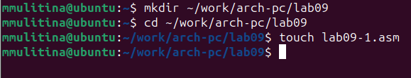{#fig:001 width=70%}

Введём текст программы и запустим её для проверки (рис. @fig:002).

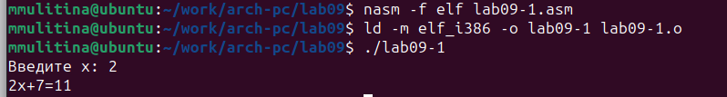{#fig:002 width=70%}

Добавим подпрограмму _subcalcul, запустим программу для проверки (рис. @fig:003).

{#fig:003 width=70%}

Создадим файл lab09-2.asm, введём в него текст программы, получим исполняемый файл и загрузим его в отладчик (рис. @fig:004).

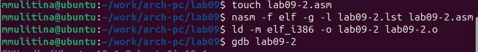{#fig:004 width=70%}

Проверим работу программы, запустим ее в оболочке GDB (рис. @fig:005).

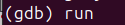{#fig:005 width=70%}

(рис. @fig:006).

{#fig:006 width=70%}

Установим брейкпоинт и запустим программу (рис. @fig:007).

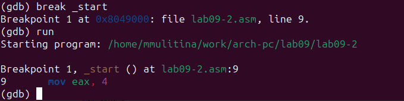{#fig:007 width=70%}

Посмотрим дисассимилированный код (рис. @fig:008).

{#fig:008 width=70%}

Переключимся на отображение команд с Intel синтаксисом  (рис. @fig:009).

{#fig:009 width=70%}

Включим режим псевдографики (рис. @fig:010).

{#fig:010 width=70%}

Проверим точки останова с помощью команды info breakpoints (рис. @fig:011).

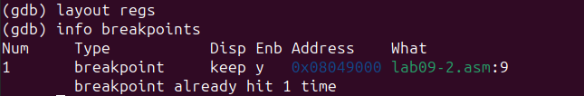{#fig:011 width=70%}

Установим ещё одну точку останова и снова посмотрим информацию о точках останова (рис. @fig:012).

{#fig:012 width=70%}

Выполним 5 инструкций с помощью команды stepi и проследим изменения регистров (рис. @fig:013).

{#fig:013 width=70%}

Изменились значения регистров eax, ecx, ebx, edx.

Посмотрим значения регистров с помощью info registers (рис. @fig:014).

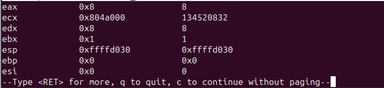{#fig:014 width=70%}

Посмотрим значение переменной msg1 по имени (рис. @fig:015).

{#fig:015 width=70%}

Изменим первый символ переменной (рис. @fig:016).

{#fig:016 width=70%}

Изменим любой символ второй переменной msg2 (рис. @fig:017).

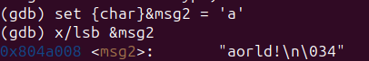{#fig:017 width=70%}

Посмотрим значений регистра edx (рис. @fig:018).

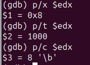{#fig:018 width=70%}

С помощью set изменим значение регистра ebx (рис. @fig:019).

{#fig:019 width=70%}

и проверим его значение (рис. @fig:020).

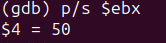{#fig:020 width=70%}

Снова изменим значение ebx  (рис. @fig:021).

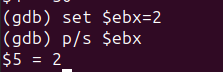{#fig:021 width=70%}

В первом случае мы ввели символьное значение, во втором цифру.

Скопируем файл из прошлой лабораторной работы (рис. @fig:022).

{#fig:022 width=70%}

Создадим исполняемый файл (рис. @fig:023).

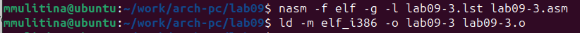{#fig:023 width=70%}

Загрузим исполняемый файл в отладчик, указав аргументы (рис. @fig:024).

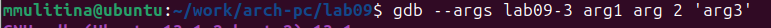{#fig:024 width=70%}

Установим точку останова перед первой инструкцией в программе и запустим её (рис. @fig:025).

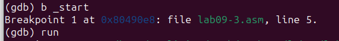{#fig:025 width=70%}

Посмотрим значение регистра esp, где хранится адрес вершины стека (рис. @fig:026).

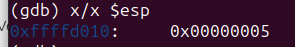{#fig:026 width=70%}

Посмотрим остальные позиции стека по адресу (рис. @fig:027).

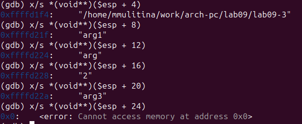{#fig:027 width=70%}

Шаг изменения равен 4, т.к. у нас 4 аргумента.

## Задания для самостоятельной работы

1. Преобразуем программу из лабораторной работы №8, реализовав вычисление значения функции как подпрограмму (рис. @fig:028).

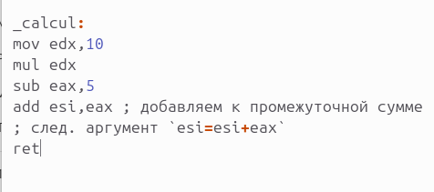{#fig:028 width=70%}

Запустим программу для проверки (рис. @fig:029).

{#fig:029 width=70%}

2. Создадим файл для программы, введём в него текст программы, запустим его в отладчике GDB (рис. @fig:030).

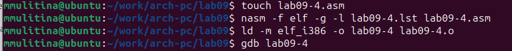{#fig:030 width=70%}

При умножении с помощью mul, мы умножаем eax на ecx b записываем в eax. Получаем 2*4=9 
вместо (3+2)*4 (рис. @fig:031).

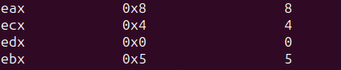{#fig:031 width=70%}

Потом скалдываем с регистром ebx 5 и получаем 10.
Проверим это, запустив программу (рис. @fig:032).

{#fig:032 width=70%}

Исправим программу (рис. @fig:033).

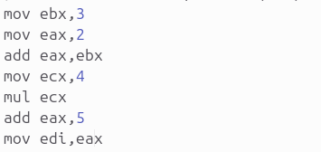{#fig:033 width=70%}

Запустим её для проверки (рис. @fig:034).

{#fig:034 width=70%}

# Выводы

В процессе выполнения работы я приобрела навыки написания программ с использованием подпрограмм и познакомилась с методами отладки при помощи GDB и его основными возможностями.

# Список литературы{.unnumbered}

Лабораторная работа №9.
