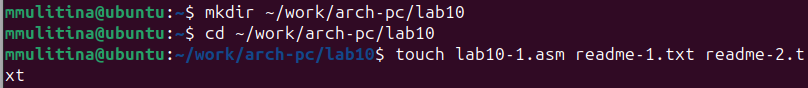
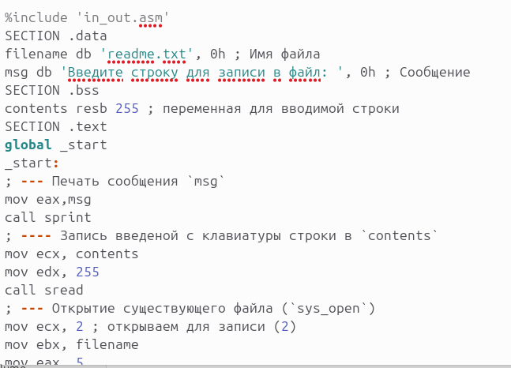
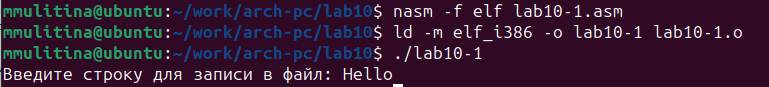
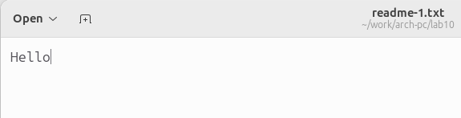
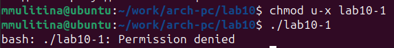
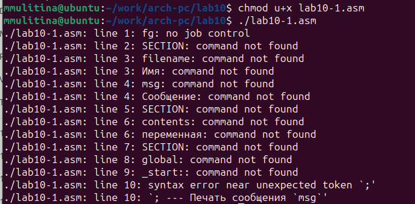
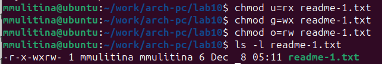
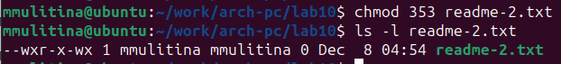
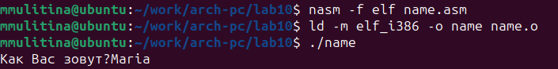
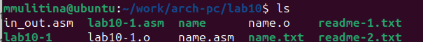

---
## Front matter
title: "Лабораторная работа №10"
subtitle: "НКАбд-06-23"
author: "Улитина Мария Максимовна"

## Generic otions
lang: ru-RU
toc-title: "Содержание"

## Bibliography
bibliography: bib/cite.bib
csl: pandoc/csl/gost-r-7-0-5-2008-numeric.csl

## Pdf output format
toc: true # Table of contents
toc-depth: 2
lof: true # List of figures
lot: true # List of tables
fontsize: 12pt
linestretch: 1.5
papersize: a4
documentclass: scrreprt
## I18n polyglossia
polyglossia-lang:
  name: russian
  options:
	- spelling=modern
	- babelshorthands=true
polyglossia-otherlangs:
  name: english
## I18n babel
babel-lang: russian
babel-otherlangs: english
## Fonts
mainfont: PT Serif
romanfont: PT Serif
sansfont: PT Sans
monofont: PT Mono
mainfontoptions: Ligatures=TeX
romanfontoptions: Ligatures=TeX
sansfontoptions: Ligatures=TeX,Scale=MatchLowercase
monofontoptions: Scale=MatchLowercase,Scale=0.9
## Biblatex
biblatex: true
biblio-style: "gost-numeric"
biblatexoptions:
  - parentracker=true
  - backend=biber
  - hyperref=auto
  - language=auto
  - autolang=other*
  - citestyle=gost-numeric
## Pandoc-crossref LaTeX customization
figureTitle: "Рис."
tableTitle: "Таблица"
listingTitle: "Листинг"
lofTitle: "Список иллюстраций"
lotTitle: "Список таблиц"
lolTitle: "Листинги"
## Misc options
indent: true
header-includes:
  - \usepackage{indentfirst}
  - \usepackage{float} # keep figures where there are in the text
  - \floatplacement{figure}{H} # keep figures where there are in the text
---

# Цель работы

Приобретение навыков написания программ для работы с файлами.

# Задание

1. Создание каталога для программ лабораторной работы №10 и создание необходимых файлов.

2. Введение в файл текста программы и её исполнение.

3. Изменение прав доступа к файлам.

4. Написание программы, создающей файл.

# Теоретическое введение

## Права доступа к файлам

ОС GNU/Linux является многопользовательской операционной системой. И для обеспечения защиты данных одного пользователя от действий других пользователей существуют специальные механизмы разграничения доступа к файлам. Кроме ограничения доступа, данный механизм позволяет разрешить другим пользователям доступ данным для совместной работы.
Права доступа определяют набор действий (чтение, запись, выполнение), разрешённых для выполнения пользователям системы над файлами. Для каждого файла пользователь может входить в одну из трех групп: владелец, член группы владельца, все остальные. Для каждой из этих групп может быть установлен свой набор прав доступа. Владельцем файла является его создатель. 
Набор прав доступа задается тройками битов и состоит из прав на чтение, запись и исполнение файла. В символьном представлении он имеет вид строк rwx, где вместо любого символа может стоять дефис. 
Буква означает наличие права (установлен в единицу второй бит триады r — чтение, первый бит w — запись, нулевой бит х — исполнение), а дефис означает отсутствие права (нулевое значение соответствующего бита). Также права доступа могут быть представлены как восьмеричное число. Так, права доступа rw- (чтение и запись, без исполнения) понимаются как три двоичные цифры 110 или как восьмеричная цифра 6.

## Работа с файлами средствами NASM

В операционной системе Linux существуют различные методы управления файлами, например, такие как создание и открытие файла, только для чтения или для чтения и записи, добавления в существующий файл, закрытия и удаления файла, предоставление прав доступа.

Обработка файлов в операционной системе Linux осуществляется за счет использования определенных системных вызовов. Для корректной работы и доступа к файлу при его открытии или создании, файлу присваивается уникальный номер (16-битное целое число) - дескриптор файла.

### Открытие и создание файла 

Для создания и открытия файла служит системный вызов sys_creat, который использует следующие аргументы: права доступа к файлу в регистре ECX, имя файла в EBX и номер системного вызова (8) в EAX.

### Запись в файл

Для записи в файл служит системный вызов sys_write, который использует следующие аргументы: количество байтов для записи в регистре EDX, строку содержимого для записи ECX, файловый дескриптор в EBX и номер системного вызова (4) в EAX.

### Чтение файла

Для чтения данных из файла служит системный вызов sys_read, который использует следующие аргументы: количество байтов для чтения в регистре EDX, адрес в памяти для записи прочитанных данных в ECX, файловый дескриптор в EBX и номер системного вызова (3) в EAX.

### Закрытие файла

Для правильного закрытия файла служит системный вызов sys_close, который использует один аргумент – дескриптор файла в регистре EBX. После вызова ядра происходит удаление дескриптора файла, а в случае ошибки, системный вызов возвращает код ошибки в регистр EAX.

### Изменение содержимого файла

Для изменения содержимого файла служит системный вызов sys_lseek, который использует следующие аргументы: исходная позиция для смещения EDX, значение смещения в байтах в ECX, файловый дескриптор в EBX и номер системного вызова sys_lseek в EAX.

### Удаление файла

Удаление файла осуществляется системным вызовом sys_unlink, который использует один аргумент – имя файла в регистре EBX.

# Выполнение лабораторной работы

 Создадим каталог для программ лабораторной работы и создадим в нем необходимые файлы (рис. @fig:001).

{#fig:001 width=70%}

Введём в файл lab10-1.asm текст программы из листинга (рис. @fig:002).

{#fig:002 width=70%}

Создадим исполняемый файл и проверим его работу (рис. @fig:003).

{#fig:003 width=70%}

(рис. @fig:004).

{#fig:004 width=70%}

С помощью команды chmod изменим права доступа к исполняемому файлу lab10-1, запретив его выполнение (рис. @fig:005).

{#fig:005 width=70%}

Доступ к файлу запрещён.

Изменим права доступа к файлу lab10-1.asm, добавив права на исполнение (рис. @fig:006).

{#fig:006 width=70%}

Файл нельзя выполнить, т.к. он не содержит указаний для терминала, а просто является текстом программы.

Предоставим права доступа к файлам в соответствии с вариантом 3 (рис. @fig:007).

{#fig:007 width=70%}

(рис. @fig:008).

{#fig:008 width=70%}

## Задание для самостоятельной работы

Напишем программу, работающую по представленному алгоритму (рис. @fig:009).

{#fig:009 width=70%}

Проверим наличие файла (рис. @fig:010).

{#fig:010 width=70%}

И его содержание (рис. @fig:011).

{#fig:011 width=70%}

# Выводы

В процессе выполнения лабораторной работы я приобрела навыки написания программ для работы с файлами.

# Список литературы{.unnumbered}

Лабораторная работа №10.
